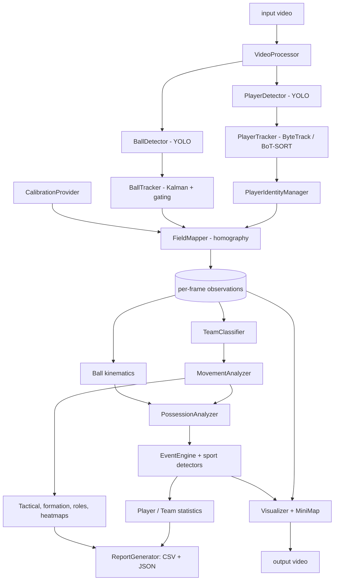

# AI Sports Performance Analyzer

An end-to-end computer-vision pipeline that turns a sports video into tracked players, a ball
trajectory, possession, inferred events (passes, shots, goals ...), player/team statistics,
heatmaps, an annotated video with a tactical mini-map, and CSV/JSON reports.

Version 1 is tuned for **football (soccer)**. Detection, tracking and movement analysis are
sport-agnostic; sport-specific rules live behind a `SportsAnalyzer` interface so basketball,
tennis or volleyball can be added without touching the perception layer.

> **Design principle - correctness over flash.** Every event is labelled as an *inference* with a
> confidence score (capped below 1). Statistics the data cannot support are **empty/null, never
> invented** (for example: no field calibration => no distance or speed).

## Features

| Area | What it does |
|---|---|
| Detection | Ultralytics YOLO players (goalkeeper/referee classes supported) + a dedicated small-object ball detector |
| Tracking | ByteTrack / BoT-SORT with persistent IDs, plus an identity manager that re-links a player after long occlusions |
| Teams | Jersey colour (grass-masked, Lab k-means) -> robust 2-cluster model -> per-track vote; referees/odd kits become *Unknown* |
| Field mapping | Homography from clicked landmarks, validated (point count, collinearity, reprojection error); position = **feet** (bottom-centre of box) |
| Movement | Outlier rejection -> resample -> Savitzky-Golay/moving-average smoothing -> speed, acceleration, sprints (min duration), zones, direction changes |
| Ball | Kalman tracker with gating, confirmation and coasting through missed detections |
| Possession | State machine `FREE -> CANDIDATE -> POSSESSION -> RELEASE -> FREE`, temporal confirmation, challenger handling |
| Events | pass, shot (+ inferred outcome), goal, possession change, sprint, tackle/interception *candidates*, out of bounds |
| Analytics | team shape (width/depth/hull), formation and role estimates (optional, inferred), time-weighted heatmaps |
| Output | annotated video (trails, mini-map, possession bar, event banner), 5 CSVs, JSON report, heatmap PNGs |

## Architecture



**Two passes, on purpose.** Pass 1 runs the neural networks per frame and stores compact
observations. The analysis stage then works on the whole timeline, because Savitzky-Golay
smoothing, outlier rejection and event confirmation need *future* frames. Pass 2 re-reads the
video and draws overlays from the finished analysis. Decoding twice is cheap next to inference.

## Technology stack

Python 3.10+, OpenCV, NumPy, Pandas, SciPy, Matplotlib, Ultralytics YOLO (ByteTrack / BoT-SORT).
No other frameworks. Output formats: CSV and JSON.

## Installation

```bash
python -m venv .venv && source .venv/bin/activate      # Windows: .venv\Scripts\activate
pip install -r requirements.txt
# GPU: install a CUDA build of PyTorch first (https://pytorch.org); the code falls back to CPU automatically.
```

## Model requirements

* **Players:** any Ultralytics YOLO detector with a `person` or `player` class. The default
  `yolov8m.pt` (COCO) is downloaded automatically on first run.
* **Ball:** COCO's `sports ball` class works but is weak on small, blurred balls. For serious use,
  fine-tune on a football dataset and set `detection.ball_model` (a class named `ball` or `sports ball`).
  A single custom model with `player`, `goalkeeper`, `referee`, `ball` classes also works - class
  names are matched by name via config, not by hard-coded ids.
* Ball-based statistics (possession, passes, shots, goals) are **withheld automatically** if the ball is
  detected in fewer than 15% of frames (`ball.min_coverage_for_events`).

## How to run

```bash
# 1. put your video at input/sports_input.mp4
# 2. calibrate the field once (click >= 4 known pitch points on a frame)
python scripts/select_calibration_points.py input/sports_input.mp4 --frame 0 --out config/calibration.json
# 3. run
python main.py --calibration config/calibration.json
# options: --config FILE  --debug  --device cpu|cuda  --max-frames N  --no-video  --output-dir DIR
```

Without calibration the pipeline still produces tracking, teams and the annotated video, but all
metric statistics are unavailable and say so (see `data_quality` in the JSON).

### Calibration file

```json
{ "frame_size": [1920, 1080],
  "image_points": [[212,330],[1710,322],[1905,880],[30,902],[960,505]],
  "landmarks": ["corner_top_left","corner_top_right","corner_bottom_right","corner_bottom_left","center_spot"] }
```
`landmarks` can be any of ~33 named pitch points (corners, penalty/goal-area corners, penalty spots,
centre circle, posts). Alternatively give `field_points` in metres directly.
**Coordinate convention:** x along the pitch length, y along the width, origin at the top-left
corner as seen by the camera (y grows toward the camera). Team A attacks +x by default
(`field.team_a_attacks_positive_x`; use `field.attack_direction_switch_s` for the second half).

## Input / output

```
input/sports_input.mp4
output/sports_analysis.mp4     annotated video, SAME resolution and FPS as the input
output/player_statistics.csv   one row per tracked identity
output/team_statistics.csv     one row per team
output/event_log.csv           timestamp, frame, event_type, player_id, team_id, confidence, metadata
output/player_tracks.csv       frame, timestamp, player_id, team, image_x/y, field_x/y, speed_kmh, confidence (+ smoothed field_x/y)
output/match_report.json       video, processing, data_quality, match, teams, players, events, tactical, formations, limitations
output/heatmaps/*.png          per player, per team, combined
```

Example `event_log.csv`:
```
timestamp,frame,event_type,player_id,team_id,confidence,metadata
00:02.12,53,PASS,8,Team A,0.850,"{""to_player"":10,""successful"":true,""distance_m"":10.8,...}"
00:05.08,127,SHOT,10,Team A,0.764,"{""outcome"":""goal"",""outcome_is_inferred"":true,...}"
00:06.36,158,GOAL,10,Team A,0.700,"{""height_verified"":false,...}"
```
`player_id` is a tracker-based identity (not a jersey number).

## Configuration

All tunables live in `sports_analyzer/config.py` (nested dataclasses). Override any subset from JSON
(`config/example_config.json`); unknown keys are rejected. Spec names map to config fields:

| Spec constant | Config field |
|---|---|
| INPUT_VIDEO / OUTPUT_VIDEO | `paths.input_video` / `paths.output_video` (default `<output_dir>/sports_analysis.mp4`) |
| PLAYER_MODEL / BALL_MODEL | `detection.player_model` / `detection.ball_model` |
| CONFIDENCE_THRESHOLD / IOU_THRESHOLD | `detection.confidence_threshold` / `detection.iou_threshold` |
| TRACKER | `tracking.tracker` (`bytetrack`, `botsort`, or built-in `iou`) |
| DEVICE | `detection.device` (`"auto"` = CUDA if available else CPU) |
| PROCESS_WIDTH / PROCESS_HEIGHT | `video.process_width` / `video.process_height` (detector input only; output is untouched) |
| POSSESSION_RADIUS | `possession.possession_radius` (metres) |
| WALKING_MAX_SPEED, JOGGING_MAX_SPEED, RUNNING_MAX_SPEED, SPRINT_THRESHOLD | `movement.*` (km/h) |
| MIN_SPRINT_DURATION | `movement.min_sprint_duration` (s) |
| TRAIL_LENGTH | `visualization.trail_length` |
| FIELD_WIDTH / FIELD_HEIGHT | `field.field_width` / `field.field_length` (metres) |
| DEBUG_MODE | `visualization.debug_mode` or `--debug` |

Performance knobs: `video.analysis_stride` (analyse every Nth frame; the output still contains every frame),
`video.batch_size`, `video.process_width`, `detection.half_precision` (CUDA only), `detection.player_imgsz`/`ball_imgsz`.
Output size equals input size unless `video.output_width/height` is set (a warning is logged).

## Statistics generated

* **Player:** playing time, distance (km), average/max speed, sprints (with start, end, duration, max speed, distance in the JSON), time and distance per speed zone, high-intensity distance, acceleration/deceleration/stop/direction-change events, possession seconds, passes (+ successful), shots (+ on target), goals, assists, interception candidates, estimated role.
* **Team:** possession %, total/average distance, passes, shots, goals, sprints, possession changes, spell durations; width, depth, hull area, centroid, spread (with in/out-of-possession phases); estimated formation per window.
* **Measured vs inferred:** distances/speeds/shape are *measurements* from tracking + calibration. Events, outcomes, formations, roles and tactical labels are *inferences* and flagged `inferred`/`is_inference`.

## Tests

```bash
pip install pytest && pytest          # or, without pytest:  python tests/run_tests.py
```
54 tests on synthetic data cover coordinate conversion, distance/speed/acceleration, sprint rules,
possession transitions, event generation (including negative cases), statistics aggregation and
`None` gating, JSON/CSV serialization, tracking/ID stability, ball tracking, team classification,
video I/O and config validation, plus an **end-to-end test** that runs the real pipeline on a synthetic
video with the YOLO detectors replaced by fakes.

## Limitations (please read)

1. **Not validated on real match footage in this repository.** The logic is verified on synthetic data; thresholds (shot speed, possession radius, goal confirmation ...) are sensible defaults you should tune on your footage.
2. **Static camera assumed.** A single homography is wrong for a panning/zooming broadcast camera. Use a fixed/tactical camera, or implement a `CalibrationProvider` that estimates a homography per frame (the hook exists; `AutomaticCalibration` is a documented stub).
3. **Ground-plane geometry.** An airborne ball maps to the wrong place, so lofted-ball speed/direction are unreliable, and goals cannot be told apart from shots over the bar (`height_verified: false`, goal confidence capped at 0.70).
4. **No re-identification / jersey OCR.** IDs are tracker based; a player hidden for longer than the re-link window becomes a new identity, which splits their statistics. Reports exclude identities shorter than `tracking.min_report_track_s`; team "average distance per player" is per *identity*.
5. **Team classification** is colour based: similar kits, heavy shadows or a green kit will confuse it; goalkeepers and referees usually end up *Unknown*.
6. **Partial views.** Team shape and formation are only meaningful if the camera shows (almost) the whole team; the report includes coverage.
7. Weak events (`tackle_candidate`, `interception_candidate`, "failed" passes) are confidence-capped at 0.6 / 0.85 and may be mislabelled clearances or loose balls.
8. Output uses the `mp4v` codec for portability; re-encode for web (`ffmpeg -i out.mp4 -c:v libx264 out_web.mp4`).
9. Variable-frame-rate videos are treated as constant FPS (`timestamp = frame / fps`).
10. Memory: observations for the whole video are kept in RAM (not measured here; a full 90-minute, 25 FPS match with ~22 tracked players is millions of observations and can reach several GB). Use `analysis_stride` or process halves separately for long videos.

## Future improvements

Automatic pitch keypoint calibration and camera-motion tracking; appearance re-identification and
jersey-number OCR; pose estimation (ball-contact, tackles, falls); action recognition / transformer
temporal models for events; ball-height estimation; fatigue and load models; tactical
recommendations; player similarity and performance prediction; automatic highlights; natural-language
match summaries. Extension points: `CalibrationProvider`, `TeamClassifier`, `EventDetector`,
`SportsAnalyzer`, `FieldModel`.

## Project structure

```
ai-sports-performance-analyzer/
|- main.py                         CLI entry point
|- requirements.txt  pytest.ini  README.md
|- config/                         example_config.json, calibration.example.json
|- scripts/select_calibration_points.py
|- docs/COMPONENTS.md              what / why / inputs / outputs / interactions for every component
|- input/  output/
|- sports_analyzer/
|  |- config.py  models.py  exceptions.py  logging_utils.py  utils.py
|  |- pipeline.py                  orchestration (no analytics logic)
|  |- analysis.py                  analysis stage (teams -> movement -> possession -> events -> stats)
|  |- video/processor.py           VideoProcessor
|  |- detection/                   PlayerDetector, BallDetector, YOLO loader
|  |- tracking/                    PlayerTracker (+ IoU fallback), PlayerIdentityManager, BallTracker
|  |- teams/classifier.py          TeamClassifier interface + colour k-means implementation
|  |- field/                       FootballField, calibration providers, FieldMapper
|  |- analytics/                   movement, ball_kinematics, possession, statistics, tactical, formation, roles, heatmaps
|  |- events/                      EventEngine, EventDetector interface, football detectors
|  |- sports/                      SportsAnalyzer interface, FootballAnalyzer, registry
|  |- visualization/               Visualizer, MiniMap
|  `- reporting/report_generator.py
`- tests/                          unit tests, synthetic match builder, end-to-end test
```
